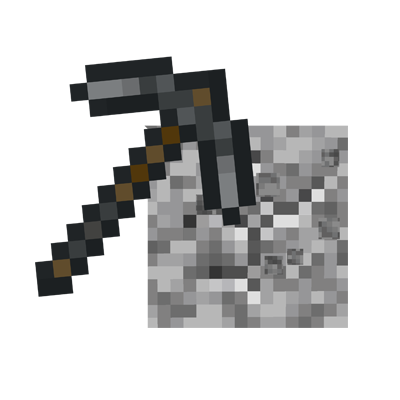

# Quick Pick Tool

This fabric mod allows the Player to use the quick pick block action to instead pick the tool that best breaks the block.  

To use this feature hold "B" (default key binding) and middle click on the block to select the tool.

## Features
- Selects pickaxe for stone like blocks
- Selects axe for wood like blocks
- Selects shovel for dirt like blocks
- Selects hoe for leave like blocks

## Dependencies
This is a Fabric mod (at this time) and requires the following:
- minecraft 1.18.1
- java 17
- fabric-api 0.46.4+

## Upcoming Features
- Adding Quick Save Block feature for silk touch priority tools
- Add glass tool blocks
- Add shear tool blocks